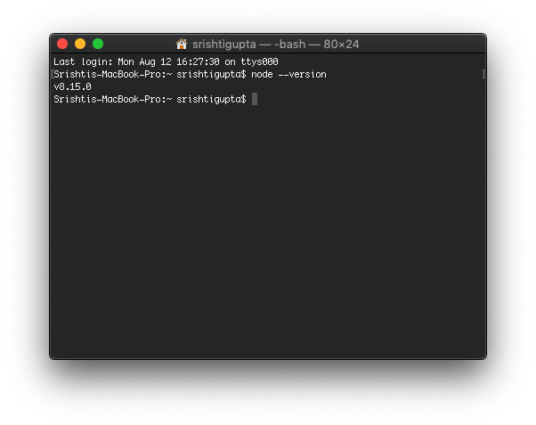

# SASS - The Complete SASS Course (CSS Preprocessor)

## Table of Contents
[01: Welcome](#01---welcome)  
[02: SASS Introduction](#02---sass-introduction)  

## 01 - Welcome

### What is SASS?
SASS stands for **Syntactically Awesome Style Sheets**.

SASS is a CSS preprocessor with syntax advancements.

-------------


### Advantages of SASS

1. SASS helps you to **write CSS code in an easier and more efficient way**. You can write CSS code like the way you do in other programming languages because SASS gives you the capability to use variables, functions, conditional statements, etc. in CSS.
2. Apart from this, SASS helps you to **split your styles in different files**, thereby helping developers to write code in a more convenient manner.

-------------


### How does SASS work in browser?
The browser is not capable of understanding SASS code on its own. It needs a transpiler for that purpose. The transpiler converts a human-readable code into another human-readable code. On the other hand, a compiler converts a human-readable code into machine language. 

In this case, the transpiler converts the human-readable code (SASS) into another human-readable code (CSS). The latter is understood by the browser. 

-------------


### Syntaxes supported by SASS
SASS supports the following two syntaxes:

**1. Indented Syntax (commonly called SASS)**  
* Indented syntax does not use the curly braces. Instead it uses indentation. 
* Rather than using the semicolon to mark the end of each property, SASS writes every property on a new line. 
* This syntax has the file extension as `.sass`. 

    ```css
    ul 
        font-size: 20px
        margin: 5px

        li
            font-size: 14px
            color: red
    ```

**2. SCSS (Sassy CSS)**  
* It is quite similar to CSS and this is why, most developers prefer using it. SCSS is a superset of CSS with a few additions.
* Like CSS and unlike Indented Syntax, SCSS uses curly braces and semicolons.  
* Every valid CSS is valid SCSS.
* This syntax has the file extension as `.scss`.  

    We'll be using SCSS in throughout this course.


    ```scss
    ul {
        font-size: 20px;
        margin: 5px;

        li {
            font-size: 14px;
            color: red;
        }
    }
    ```


-------------


## 02 - SASS Introduction

### Getting Started with SCSS

#### Steps:
1. Install a text editor on your system. I'll be using **Visual Studio Code**.

2. Install a web browser on your system. I'll be using **Google Chrome**.

3. Install **Node.js** on your system because you need to install a Node package named `node-sass`.  
You can download Node.js from [this](https://nodejs.org/en/download) link. 

4. To **validate if Node.js is successfully installed** on your system, type the following command in your Terminal or Command Prompt:
    ```
    node --version
    ```

    If Node.js is successfully installed on your machine, you will get its version returned to you.

    

5. Create a folder for your entire project. Let's name this folder **`learn-sass`**.

6. Inside the folder `learn-sass`, create a file named **`index.html`**. Populate this file with basic HTML code.

7. Inside the folder `learn-sass`, create a folder for all stylesheets. Let's name this folder **`css`**.

8. Inside the `css` folder, create a stylesheet named **`main.css`**. This file will be linked to `index.html` file. Remember that you are not going to write any code inside `main.css` file. You'll write all your code inside SCSS files, which will be transpiled to `main.css` file and will be eventually be rendered by the browser.

9. Inside `index.html` file, add `main.css` as the **external stylesheet**.
    ```html
    <link rel="stylesheet" href="css/main.css">
    ```

10. Inside the folder `learn-sass`, create a folder for all SCSS files. Let's name this folder **`scss`**.

11. Inside the `scss` folder, create a stylesheet named **`main.scss`**. Start writing your code in this file. For testing purposes, let's add the following piece of code to this file:
    ```scss
    body {
        background-color: beige;
    }
    ```

12. Open your Terminal or Command Prompt. Alternatively, you can click on _View -> Terminal_ (or press keyboard shortcut `Ctrl + `\`). Then, write the following command inside the root directory (`learn-sass`) of your project:
    ```
    npm init --yes
    ```
    This command will **initialize your folder as the Node project**. The option `--yes` is used to avoid providing values to different questions asked when initializing the folder as the Node project. This command will also create a `package.json` file in your project, which works as the manifest file for your entire project.

13. **Install SASS transpiler** which will convert SASS code into CSS. For this, type the following command inside the root directory (`learn-sass`) of your project:
    ```
    npm install -g node-sass
    ``` 
    The `-g` option installs the `node-sass` package globally on your machine so that you can use this package inside any folder on your local system.

14. Use the SASS tranpiler to **transpile the SCSS code into CSS code** by writing the following command inside the root directory (`learn-sass`) of your project:
    ```
    node-sass -o css scss/main.scss
    ```
    The option `-o` stands for output. `css` represnts the folder inside which you want the compilation to be done. `scss/main.scss` represents the path of the SASS file, which needs to be transpiled to CSS.

    You will see the following output in your Terminal or Command Prompt:

    

    If you go back and check your `main.css` file inside the `css` folder, it will now contain the transpiled code from its corresponding file in the `scss` folder named `main.scss`. 
    
15. Click on the **Go Live** option available at the bottom-right corner of Visual Studio Code. This will start a local development server and will open your `index.html` file in your browser.

16. To verify again, go back to `scss/main.scss` and change the `background-color` property by giving it some other color. Then, again run the command given in step 14. Reload your webpage on the browser. In order to avoid reloading the webpage again and again, you can specify the **option `-w`** while specifying the command in step 14. This will ensure that the code is tranpiled on each change and the webpage on the browser is loaded automatically. So, the command that you now have to run is:
    ```
    node-sass -o css scss/main.scss -w
    ```

17. You can set up an **alias command** for the command written in step 16 in your `package.json` file. For this, go to your `package.json` file. Inside the key `scripts`, add a key `watch` (or you can replace the key `test` with the key `watch`) and the value corresponding to this key is the command that you've specified in step 16. Thus, the key `scripts` inside the `package.json` file looks like this:
    ```json
    "scripts": {
        "watch": "node-sass -o css scss/main.scss -w"
    }
    ```

    After adding the `watch` key, you can come back to the root directory (`learn-sass`) of your project and then run the following command:
    ```
    npm run watch
    ```
    The above command will automatically run the command for which `watch` is an alias in the `package.json` file. 


-------------


### SASS Variables

Variables can be used in CSS too but they still have partial support in some of the browsers. 
On the other hand, variables in SASS are more convenient and flexible to be used. Also, SASS variables are converted back to raw CSS. So, you do not have to worry about the browser support.

**Points to Remember:**
1. A variable in SASS is declared using `$` symbol.
    
    Example:
    ```scss
    $color-primary: gray;
    $font-lg: 40px;
    ```

2. The declared variable can then be used with CSS properties.  

    Example:
    ```scss
    $color-primary: gray;
    $font-lg: 40px;

    h1 {
        color: $color-primary;
        font-size: $font-lg;
    }
    ```

    The transpiled CSS code for the code given above will be:

    ```css
    h1 {
        color: gray;
        font-size: 40px;
    }
    ```

3. The scope of SASS variables can be _global_ or _local_. SASS variables are scoped locally when they are declared inside curly braces and scoped globally otherwise. 

    Example:
    ```scss
    $color-primary: gray; // global-scoped variable

    h1 {
        $font-lg: 40px; // local-scoped variable
        color: $color-primary;
        font-size: $font-lg;
    }
    ```

4. When you want to convert a local-scoped variable to a global-scoped variable, you can use `!global` after the variable declaration.

    Example:
    ```scss
    $color-primary: gray;
    $color-secondary: orange;

    h1 {
        $font-lg: 40px !global; // global-scoped variable
        color: $color-primary;
        font-size: $font-lg;
    }

    h2 {
        color: $color-secondary;
        font-size: $font-lg;
    }
    ```
    _Try to avoid using this method._

5. The characters `-` and `_` are interchangable in variable names. It's perfectly fine to access a variable with `-` which is defined with `_`.

    Example:
    ```scss
    $color-primary: gray; 

    h1 {
        color: $color_primary;
    }
    ```


-------------


### Nesting in SASS

Nesting allows you to avoid writing multiple lines of CSS code and serves as a shortcut for creating CSS rules.

**Points to Remember:**

1. With SCSS, you can just nest your CSS code inside parent code and the parent selector(s) will automatically be prefixed with the child selector(s). Consider the following code snippet in SCSS:

    SCSS Code:
    ```scss
    $color-primary: gray;

    .nav {
        background-color: $color-primary;

        ul li {
            list-style: none;
        }
    }
    ````

    The transpiled CSS code snippet is given below:

    CSS Code:
    ```scss
    $color-primary: gray;
    .nav {
        background-color: $color-primary; 
    }
    .nav ul li {
        list-style: none; 
    }
    ```

    Writing code in SCSS is far more convenient than manually prefixing the parent selector(s) time and again in CSS.

    However, it is always advisory to _not have too many levels of nesting_.

2. There are a couple of times when you need to be cautious when nesting SASS code. Consider the following code snippet:

    ```scss
    $color-primary: gray;
    $color-secondary: orange;

    a {
        text-decoration: none;
        color: $color-primary;

        :hover {
            color: $color-secondary;
        }
    }
    ```

    In the code snippet given above, the hover effect does not work because when the code gets transpiled to CSS, the selector becomes `a :hover`. Notice that there's a space between `a` and `:hover` which makes the syntax invalid. This problem can be solved by using `&`. Refer to the example given below:

    ```scss
    $color-primary: gray;
    $color-secondary: orange;

    a {
        text-decoration: none;
        color: $color-primary;

        &:hover {
            color: $color-secondary;
        }
    }
    ```

    `&` refers to the parent selector. 
    
    In the example given above, `&:hover` works fine because `&` is replaced by the parent selector `a` when the code is transpiled to CSS. Thus, the transpiled code consists of `a:hover`, which works perfectly fine.


-------------


### Mixins

A mixin refers to a block of code which represents reusable CSS styles. Mixins are like variables in terms of their reusability but unlike variables, they can contain various CSS styles grouped together.

**Syntax for defining a generic mixin:**
```scss
@mixin nameOfMixin {
    // code
}
```

**Syntax for using a mixin:**
```scss
selector {
    @include nameOfMixin;
}
```

Consider the following example:

```scss
$color-secondary: orange;
$font-lg: 40px;
$font-md: 30px;

.banner h1 {
	font-size: $font-lg;
	color: $color-secondary;
	text-align: center;
}

.footer h3 {
	font-size: $font-md;
	color: $color-secondary;
	text-align: center;
}
```

In the code snippet given above, the CSS rule for `color` and `text-align` are common in both `h1` of `banner` class as well as in `h3` of `footer` class. So, we can use a mixin which consists of this common code and eliminate our code redundancy.

```scss
$color-secondary: orange;
$font-lg: 40px;
$font-md: 30px;

@mixin headingStyles {
	color: $color-secondary;
	text-align: center;
}

.banner h1 {
	font-size: $font-lg;
	@include headingStyles;
}

.footer h3 {
	font-size: $font-md;
	@include headingStyles;
}
```

**Points to remember:**

1. You can make your mixin behave like a function.

    **Syntax for defining a function-like mixin:**
    ```scss
    @mixin nameOfMixin(parametersList) {
        // code
    }
    ```

    Let's take an example to understand this better.

    ```scss
    $color-secondary: orange;
    $font-lg: 40px;

    @mixin headingStyles($fontSize) {
        font-size: $fontSize;
        color: $color-secondary;
        text-align: center;
    }

    .banner h1 {
        @include headingStyles($font-lg);
    }

    .footer h3 {
        @include headingStyles(20px);
    }
    ```

    In the above example, `headingStyles` is a mixin that works like a function. Inside the classes - `banner` and `footer`, it is invoked as a function while passing in arguments (variable `$font-lg` in `banner` class and value `20px` in `footer` class).

2. You can define default value for a parameter in a mixin which will be used when you do not pass an argument to the parameter. Consider the code snippet given below:

    ```scss
    $color-secondary: orange;
    $font-lg: 40px;

    @mixin headingStyles($fontSize: 50px) {
        font-size: $fontSize;
        color: $color-secondary;
        text-align: center;
    }

    .banner h1 {
        @include headingStyles($font-lg);
    }

    .footer h3 {
        @include headingStyles;
    }
    ```

    In the example given above, the mixin `headingStyles` in `footer` class has not been passed any argument. In fact, it has not even been invoked like a function. Still, it works fine and the default `font-size` of `50px` is assigned to the `footer` class.

3. You can also provide varied number of arguments to a mixin and all these arguments can be catched inside a single parameter. 

    **Syntax for varied number of arguments to a mixin:**

    ```scss
    @mixin transition($param...) {
        transition: $param;
    }
    ```

    Remember to use three dots `...` after the parameter name in the function's signature. 

    Example:
    ```scss
    $color-primary: orange;
    $color-tertiary: royalblue;

    @mixin transition($param...) {
        transition: $param;
    }

    .footer h3 {
        @include transition(color .5s, background-color 1s);

        &:hover {
            color: $color-tertiary;
            background-color: $color-primary;
        }
    }
    ```


-------------


### Extend

Extend allows one selector to inherit the styles of another selector. This helps you to ensure code reusability.

**Syntax for using extend:**
```scss
@extend selectorToCopyCssFrom
```

Example:
```scss
$color-primary: orange;
$color-secondary: gray;
$font-lg: 40px;

.heading {
	color: $color-primary;
	font-size: $font-lg;
	background-color: $color-secondary;
	text-align: center;
}

.banner h1 {
	@extend .heading;
}

.footer h3 {
	@extend .heading;
}
```

The code given above, when transpiled to its corresponding CSS code, looks like the one given below:

```scss
.heading, .banner h1, .footer h3 {
	color: $color-primary;
	font-size: $font-lg;
	background-color: $color-secondary;
	text-align: center;
}
```

In the CSS code that you've seen above, you can witness that how `extend` helps you to reuse your code.

An important point to remember is that you **cannot extend nested selectors** failing which, you'll get an error `can't extend nested selectors`. Consider the example code given below:

```scss
$color-primary: orange;
$color-secondary: gray;
$font-lg: 40px;

.heading {
	color: $color-primary;
	font-size: $font-lg;
	background-color: $color-secondary;
	text-align: center;
}

.banner h1 {
	@extend .heading; /* extending heading */

	&:hover {
		background-color: green;
	}
}

.footer h3 {
	@extend .banner h1; /* extending h1 from 'banner' class - THROWS ERROR */
}
```

A quick fix can be to assign a separate class to the `h1` tag inside the `banner` class and directly use the assigned class.

```scss
$color-primary: orange;
$color-secondary: gray;
$font-lg: 40px;

.heading {
	color: $color-primary;
	font-size: $font-lg;
	background-color: $color-secondary;
	text-align: center;
}

.bannerHeading {
	@extend .heading; /* extending heading */

	&:hover {
		background-color: green;
	}
}

.footer h3 {
	@extend .bannerHeading; /* works fine */
}
```

In the code snippet given above, notice that the selector `.banner h1` has been replaced with the selector `.bannerHeading`.


-------------


### Functions

Like other programming languages, you can write functions in SASS in order to carry out a business logic. 

**Syntax for defining a function:**
```scss
@function functionName(parametersList) {
    /* code */
    /* @return someThing (OPTIONAL) */
}
```

For example, consider the following function which doubles the font-size:
```scss
$font-sm: 20px;

@function fontSize($size) {
	@return $size * 2;
}

.banner p {
	font-size: fontSize($font-sm);
}
```

**Points to remember:**

1. You can provide a default value to a parameter which will be taken when no argument is provided to that parameter while invoking the function. Consider the following code snippet:

    ```scss
    $font-sm: 20px;

    @function fontSize($size: 25px) {
        @return $size * 2;
    }

    .banner p {
        font-size: fontSize($font-sm);
    }

    .footer p {
        font-size: fontSize();
    }
    ```

    In the example given above, you can see that the `fontSize` function is not passed any argument in the `p` tag in the `footer` class. This is when the default `font-size` of `25px` is taken.

2. SASS also provides some built-in functions, as discussed below:

    A. `lighten()`  
    
    Syntax:
    ```scss
    lighten(colorCode, percentageByWhichColorNeedsToBeLightened);
    ```
    Example:
    ```scss
    .nav {
        background-color: lighten(orange, 20%);
    }
    ```

    B. `darken()` 

    Syntax:
    ```scss
    darken(colorCode, percentageByWhichColorNeedsToBeDarkened);
    ```
    Example:
    ```scss
    .nav {
        background-color: darken(orange, 20%);
    }
    ```

    The functions `lighten` & `darken` are frequently used with hover effects.

    C. `transparentize()`  

    Syntax:
    ```scss
    transparentize(colorCode, valueBetween0And1);
    ```
    Example:
    ```scss
    .nav {
        background-color: transparentize(orange, 0.6);
    }
    ```
    When the `transparentize()` function is transpiled to CSS code, the function is converted to RGBA value where the opacity is affected by the value you provide as the second argument to the function.

    _OpacityInTranspiledCssCode = 1 - valueOfSecondArgumentProvided_

    As per the formula given above, if you give the second argument as 0.6, then the opacity in the transpiled CSS code will be 0.4.

    D. `mix()`

    Syntax:
    ```scss
    mix(colorCode1, colorCode2, ?percentageOfColor1);
    ```
    Example:
    ```scss
    .nav {
        background-color: mix(orange, blue);
    }
    ```
    This function allows you to mix two different colors. The third argument is optional which defines the percentage of first color to be mixed with the second color.

    Example:
    ```scss
    .nav {
        background-color: mix(orange, blue, 10%); // mix 10% orange color with 90% blue color
    }
    ```

    [List of all built-in functions in SASS](https://sass-lang.com/documentation/functions)

-------------


### Placeholder Selectors

In order to use `extend`, you need to first create a selector and then assign some CSS rules to it. After that, you extend that selector. There's an even better approach to this where you do not need to create a selector explicitly. You can achieve this using _placeholder selectors_.

Consider the code snippet given below where `h1` extends `heading` class and `h3` in `footer` class extends `h1`:
```scss
$color-primary: orange;
$color-secondary: gray;
$font-lg: 40px;

.heading {
	color: $color-primary;
	font-size: $font-lg;
	background-color: $color-secondary;
	text-align: center;
}

h1 {
	@extend .heading;

	&:hover {
		background-color: green;
	}
}
```

The transpiled CSS code for the above SCSS code looks like this:

```css
.heading, h1 {
    color: orange;
    font-size: 40px;
    background-color: gray;
    text-align: center; 
}

h1:hover {
    background-color: green; 
}
```

Now, in your SCSS code, if you remove `@extend .heading` from the `h1` selector and you do not use the `heading` class anywhere else in your code, you would see that the transpiled CSS code still consists the `heading` class. Obviously, the `heading` class is not required in this case. This problem can be solved by using the placeholder selector defined by the symbol `%`.

**Syntax of placeholder selector:**
```scss
%selectorName {
    /* code */
}
```

If you want to extend the placeholder selector, you can do it using the normal syntax of `extend` but using the `%` symbol along with the selector, as shown in the syntax given below:

```scss
%selectorName {
    /* code */
}

anotherSelector {
    @extend %selectorName;
}
```

Following example will make it clear:

```scss
$color-primary: orange;
$color-secondary: gray;
$font-lg: 40px;

%heading {
	color: $color-primary;
	font-size: $font-lg;
	background-color: $color-secondary;
	text-align: center;
}

h1 {
    @extend %heading;
    
    &:hover {
		background-color: green;
	}
}
```

The transpiled CSS code for the above SCSS code is given below:

```css
h1 {
    color: orange;
    font-size: 40px;
    background-color: gray;
    text-align: center; 
}

h1:hover {
    background-color: green; 
}
```

If you look carefully, the `heading` class does not exist in the transpiled CSS code. 

This is a very useful feature of SASS. The placeholder selectors are based on the assumption that when there'll be some code utilizing them, only then the code inside the placeholder selectors will be transpiled to CSS code. Let's validate this. Remove the statement `@extend %heading;` inside `h1`, as shown in the code snippet given below:

```scss
%heading {
	color: $color-primary;
	font-size: $font-lg;
	background-color: $color-secondary;
	text-align: center;
}

h1 {
    &:hover {
		background-color: green;
	}
}
```

You will notice that the entire code of the `heading` class will not be transpiled into CSS code, as given below:

```css
h1:hover {
    background-color: green; 
}
```

So, you can now see that if the placeholder selector is not used anywhere in the code, its code is not transpiled to CSS code. This is especially useful for plugging in code as and when required.


-------------


### Imports and Partials

You can split your SASS code into multiple files and make your project code more structured. These files are known as **partials**. The code written inside the partial files should be imported inside the main SCSS file. This can be done using the `import` statement.

**Steps:**
1. Create a new file named `test.scss` inside the folder `scss`. Write some code inside this file. Let's write the following code snippet:

    ```scss
    body {
        background-color: beige; 
    }
    ```

2. Run the command `npm run watch` in your Terminal. Nothing will happen right now. The code written inside your `test.scss` file will not be reflected on your webpage. This is because in your `package.json` file, you have mentioned that only the code inside the `main.scss` file in the `scss` folder should be transpiled. 

3. Change the `scripts` inside the `package.json` file to the following code:

    ```json
    "scripts": {
        "watch": "node-sass -o css scss -w"
    }
    ```

    Basically, what you need to do is tell the script that everything residing inside the `scss` folder needs to be transpiled to CSS code. Thus, you mention just the name of the folder (`scss` in this case) without mentioning the file `main.scss` in the path.

4. Run the command `npm run watch` in the Terminal again and then save the file `test.scss`. You will see that a file named `test.css` has been added to the `css` folder and it consists of the transpiled CSS code from the `test.scss` file but still you won't be able to see any changes of the `test.css` file on your webpage. This is because in the `index.html` file, you have added only `main.css` external stylesheet. 

    Now, one of the options that you can think of is adding `test.css` file in your `index.html` file as the external stylesheet. But this is not a scalable approach. In future, if you have SCSS multiple files, you can't keep coming back to the `index.html` file and add their corresponding CSS files. 

    Thus, essentially, you do not need a separate `test.css` file in your `css` folder. Rather, what you need is keep writing the modular SCSS code in _partials_ but generate a single transpiled source of CSS code, which is included in your `index.html` file. Therefore, you need all your transpiled code to reside in the `main.css` file, which is added as an external stylesheet in the `index.html` file.

5. Rename your file `test.scss` to `_test.scss`. The `_` in front of the file denotes that it is a _partial_.

6. Import your `test.scss` file in your `main.scss` file using the import statement as follows:

    ```scss
    @import "test"; // path of the file to be imported
    ```

    You do not need to specify `_` or extension of the file. The transpiler can directly look for the files using the name of the file.

7. Run the command `npm run watch` inside your Terminal. You can now see that your CSS changes are reflected on your webpage. Also, inside your `main.css` file, you can see that the transpiled CSS code of `test.scss` also exists.